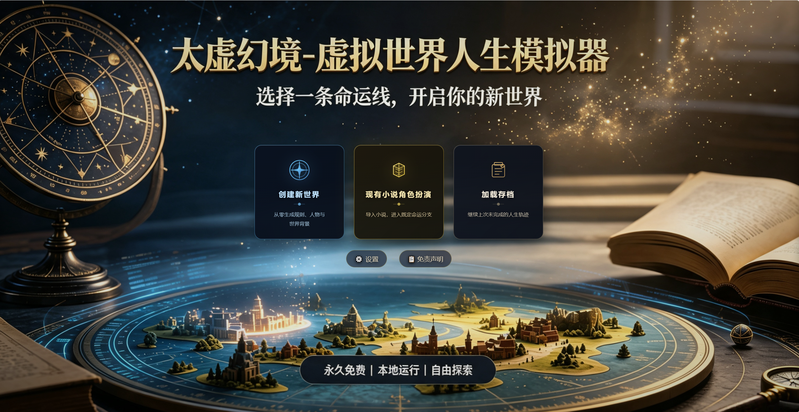

# 太虚幻境 — 虚拟世界人生模拟器

> 无限世界文字推演引擎 · 闭环学习 + 多智能体协调 + 因果演化

[](https://python.org)
[](https://fastapi.tiangolo.com)
[](LICENSE)
[](#版本演进)

**太虚幻境**（Chronoverse）是一个基于大语言模型（LLM）的虚拟世界人生模拟器。玩家通过自然语言与一个动态演化的虚构世界交互，系统实时生成叙事文本、驱动 NPC 自主行为、管理世界经济与社会关系，并维持长期的故事一致性。



---

## ✨ 核心特性

### 🌍 世界与叙事
- **AI 驱动叙事**：所有故事内容由 LLM 实时生成，每次游戏体验独一无二
- **开放世界生成**：支持 8 种世界类型（历史/奇幻/科幻/末日/武侠/仙侠/现代/自定义）
- **闭环学习**：叙事审查器从历史中提取经验教训，反馈到后续生成
- **金手指叙事规范**：开启金手指时禁止游戏化文本，所有超凡元素用小说笔法融入（v1.5.1）
- **场景自适应检索**：SceneDetector 识别当前场景类型，动态调整检索策略

### 🤖 NPC 智能体系统
- **多智能体协调**：玩家、NPC、世界各由独立 AI 代理管理
- **NPC 行动裁决层**：ActionArbiter 过滤 AI 空想，DiceEngine 概率判定，PerceptionScope 视野隔离（v1.2）
- **NPC 分层智能（LOD）**：根据重要度动态调整 NPC 的 LLM 调用频率（v1.2）
- **NPC 动机引擎**：6 类动机触发器（survival/social/career/exploration/legacy/transcendence），每日衰减（v1.5 P2）
- **NPC 性格演化**：创伤事件触发性格转折，7 天冷却期，持久化轨迹（v1.3）
- **NPC 私密档案**：LLM 生成 3-5 条私密事实，普通模式由玩家开关控制（v1.3）
- **职业日程模板**：NPC 按职业执行日常作息，休眠 NPC 唤醒推演（v1.2）
- **后台 NPC 生成**：进入游戏后 cheap_llm 后台逐步补充重要 NPC，目标 50 个（v1.5.2 修复）
- **AI 辅助添加角色**：玩家可让 AI 根据世界设定生成 NPC，预览确认后才正式加入（v1.5.2）

### 🧠 记忆与知识系统
- **分层记忆**：短期记忆 + 长期摘要 + 长期身份语义核心，三重记忆架构
- **统一记忆框架**：5 个常驻 md 文件（world_brief/npc_dossiers/player_profile/active_threads/meta_memory）（v1.5 P1）
- **自适应 Ebbinghaus 遗忘曲线**：半衰期随游戏天数自适应，重要性影响衰减（v1.5 P1）
- **GraphRAG 时序关系**：构建带时间戳的实体关系图谱，支持时序检索（v12）
- **CRAG+HyDE 检索管线**：假设文档生成 + 检索评估 + 查询重写，提升召回质量
- **NPC 程序性记忆**：NPC 从经验中学习，相似记忆自动合并

### ⚡ 因果与世界演化
- **蝴蝶效应审批门**：高影响力行为需玩家确认，防止意外崩坏
- **因果链可视化**：多维度重要性计算，Cytoscape.js 图谱展示（v1.3）
- **世界自主运行**：AutoRun 引擎让世界自我演化 N 天，自动生成章节体叙事（v1.2）
- **世界时钟与事件系统**：跨日生成玩家事件 + 世界事件，闭关/隐居降低打扰概率（v1.5 P1）
- **立场名誉系统**：7 级立场（仁善→唯我），名誉影响初次见面加成（v1.5 P2）
- **血缘传承**：NPC 自然死亡触发继承（长子→长女→配偶→徒弟→家族成员）（v1.5 P2）

### 🛡️ 安全与稳定性
- **LLM 预算控制**：BudgetGuard 三层保护（每日USD/每回合上限/熔断），超支自动降级（v1.3）
- **Prompt 注入防护**：玩家输入 fence 包裹 + 控制字符过滤 + 长度截断（v1.4）
- **认证漏洞修复**：DNS rebinding 防护，访问令牌同步（v1.4）
- **存档版本迁移**：链式迁移框架，每步自动备份，支持断点续传（v1.4）
- **LLM 调用降级兜底**：超时/失败时生成事件日志摘要，避免无输出（v1.5.2）

### 🎮 游戏体验
- **思维树预规划**：可视化 NPC 思维链，防连点保护，轮询进度反馈（v1.5.2）
- **脑内碎碎念**：查看 NPC 内心独白，失败时兜底文案（v1.5.2）
- **小说角色扮演**：导入既有小说，选择角色与章节进入，注入原著记忆/关系图谱（v12+）
- **SillyTavern 生态兼容**：角色卡、世界书双向导入导出
- **容器化部署**：Dockerfile + docker-compose，支持服务器托管（v1.4）

---

## 🚀 快速开始

### 普通玩家
```bash
# Windows 用户直接双击 启动.bat
.\启动.bat
```

### 开发者
```bash
pip install -r requirements.txt
python server.py
```

访问 http://localhost:8004

### 配置 LLM
复制 `config.json.example` 为 `config.json`，填入你的 LLM API 配置：

```json
{
  "main_llm": {
    "model": "doubao-seed-2.0",
    "api_key": "your-api-key",
    "base_url": "https://ark.cn-beijing.volces.com/api/coding/v3"
  },
  "cheap_llm": {
    "model": "doubao-seed-2.0-lite",
    "api_key": "your-api-key",
    "base_url": "https://ark.cn-beijing.volces.com/api/coding/v3"
  }
}
```

---

## 📡 主要 API 端点

| 端点 | 方法 | 说明 |
|------|------|------|
| `/api/generate-worldview` | POST | 生成世界观 |
| `/api/generate-world` | POST | 创建游戏世界 |
| `/api/npc/async-create` | POST | 启动后台 NPC 生成 |
| `/api/npc/preview-batch` | POST | AI 生成 NPC 预览（v1.5.2） |
| `/api/npc/confirm-spawn` | POST | 确认将预览的 NPC 加入世界（v1.5.2） |
| `/api/auto-run/start` | POST | 启动世界自主运行 |
| `/api/npc/{id}/preplan` | POST | NPC 思维树预规划 |
| `/api/npc/{id}/brain-whisper` | GET | NPC 脑内碎碎念 |
| `/api/v10/dashboard` | GET | v10 全系统概览 |
| `/api/v10/butterfly-approvals` | GET | 待审批蝴蝶效应 |
| `/api/v10/curator-stats` | GET | 记忆 Curator 统计 |

---

## 📁 项目结构

```
太虚幻境/
├── server.py                 # FastAPI 入口
├── index.html                # 主页面
├── frontend/                 # 前端资源
│   ├── css/style.css
│   └── js/
│       ├── game.js           # 游戏主逻辑
│       ├── game-npc.js       # NPC 对话/编辑
│       ├── game-world.js     # 世界地图
│       ├── planner_panel.js  # 思维树面板
│       ├── auto_run.js       # 自主运行
│       └── ...               # 各类功能面板
├── modules/                  # 核心模块
│   ├── game_engine.py        # 游戏引擎
│   ├── npc_spawner.py        # NPC 生成器
│   ├── turn_processor_v2.py  # 回合处理器
│   ├── narrative_engine.py   # 叙事引擎
│   ├── memory_curator.py     # 记忆管理
│   ├── branch_planner.py     # 思维树规划
│   ├── butterfly_effect.py   # 蝴蝶效应
│   ├── auto_run.py           # 自主运行引擎
│   ├── llm/                  # LLM 集成层
│   ├── retrieval/            # 检索管线（BM25/CRAG/Hybrid）
│   ├── memory/               # 记忆系统
│   └── prompt/               # Prompt 模板
├── routes/                   # API 路由
├── plugins/                  # 插件系统
│   ├── achievements.py       # 成就系统
│   ├── battle_system.py      # 战斗系统
│   └── weather_enhanced.py   # 天气增强
├── tests/                    # 测试套件
└── 白皮书.md                 # 技术白皮书
```

---

## 🔄 版本演进

| 版本 | 核心能力 |
|------|---------|
| v1-v8 | 基础叙事、NPC 系统、经济、存档 |
| v1.2 | NPC 行动裁决层、自主运行、NPC LOD |
| v9 | 安全中间件、访问令牌、EventBus |
| v10 | 闭环学习、多智能体叙事、分层记忆、蝴蝶审批门 |
| v10+ | NPC 技能自学、自主记忆管理、MCP 工具协议 |
| v10+++ | 后台 NPC 生成、SillyTavern 兼容 |
| v11 | 访问令牌同步、撤销操作、多客户端隔离 |
| v12 | GraphRAG 时序关系、角色动态状态、场景自适应检索 |
| v12+ | 小说角色扮演：剧情介绍生成、dormant NPC、偏离度追踪 |
| v1.3 | LLM 预算控制、NPC 性格演化、NPC 私密档案、因果链可视化 |
| v1.4 | 认证漏洞修复、GameEngine Mixin 拆分、容器化部署、存档迁移 |
| v1.5 P1 | 统一记忆框架、Ebbinghaus 遗忘曲线、世界时钟与事件系统 |
| v1.5 P2 | NPC 动机引擎、立场名誉系统、血缘传承、事件历史归档 |
| v1.5.1 | 金手指叙事规范、自主运行时间预估、加载存档恢复世界观 |
| v1.5.2 | NPC 生成器修复、AI 辅助添加角色、预规划防连点、LLM 降级兜底 |

---

## 📚 详细文档

- [技术白皮书](白皮书.md) — 完整架构与设计原理
- [插件开发指南](plugins/PLUGIN_DEV_GUIDE.md) — 自定义插件开发
- [贡献指南](CONTRIBUTING.md) — 参与项目贡献

---

## 🙏 致谢

- [Hermes Agent](https://github.com/NousResearch/hermes-agent) — 闭环学习、多智能体、记忆系统设计灵感
- [Nous Research](https://hermes-agent.nousresearch.com) — 自进化 Agent 架构
- 所有 LLM 服务提供商（火山引擎豆包、SiliconFlow 等）

---

## 📄 许可证

MIT License
