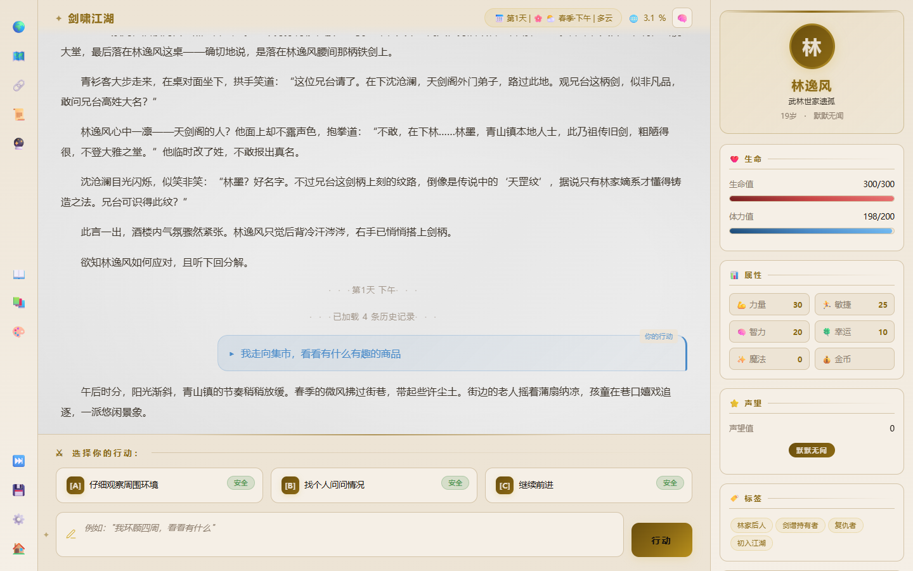
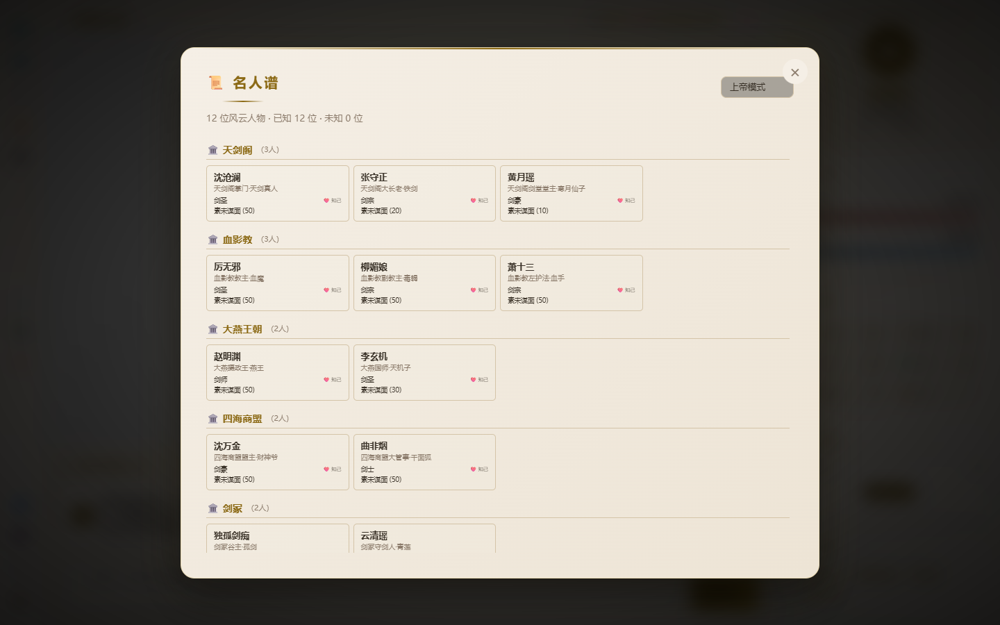
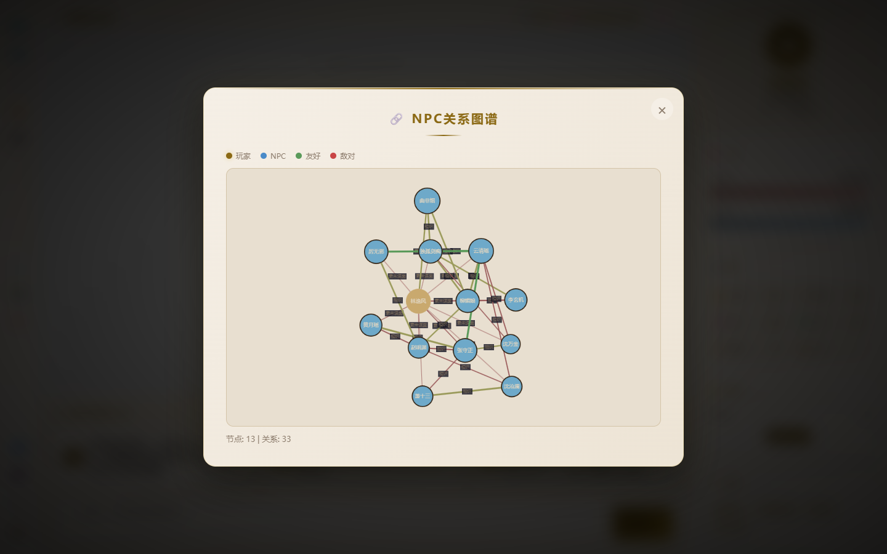
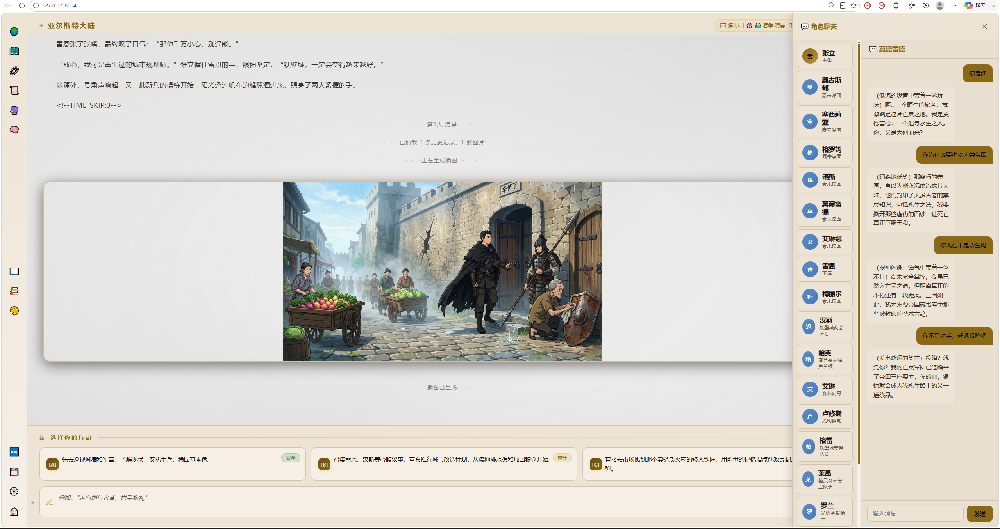
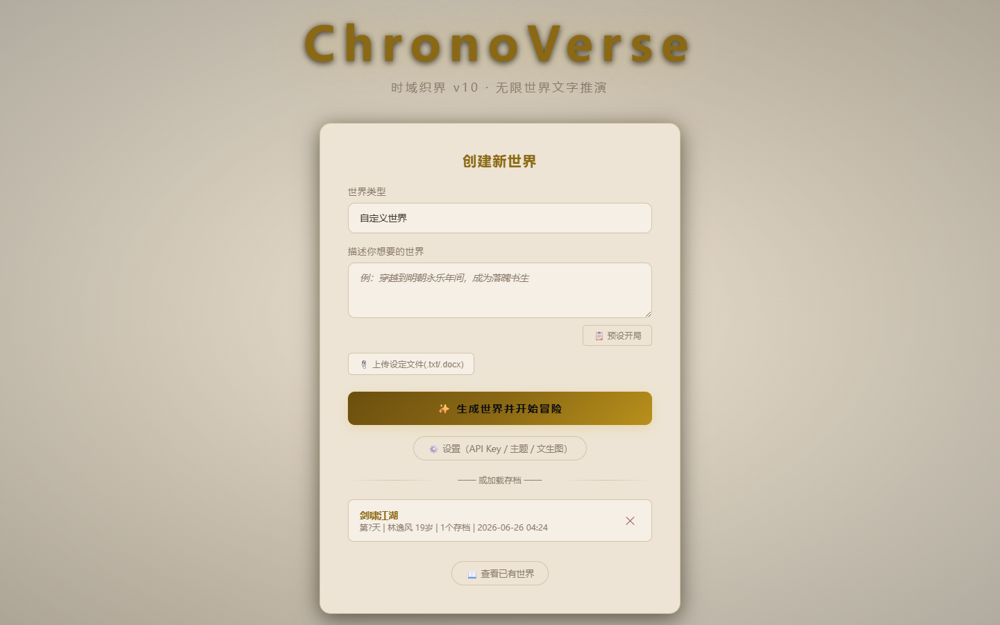

# 太虚幻境 — 虚拟世界人生模拟器

> 无限世界文字推演引擎 · 多智能体协调 + 闭环学习 + 分层记忆 + 蝴蝶效应 + 小说角色扮演

[](https://python.org)
[](https://fastapi.tiangolo.com)
[](LICENSE)

**太虚幻境**（Chronoverse）是一个基于大语言模型（LLM）的虚拟世界人生模拟器。玩家通过自然语言与一个动态演化的虚构世界交互，系统实时生成叙事文本、驱动 NPC 自主行为、管理世界经济与社会关系，并维持长期的故事一致性。

---

## 程序运行截图

<p align="center">
  
</p>

**游戏主界面**：沉浸式叙事界面，右侧角色状态面板，下方多选项决策系统。

---

<p align="center">
  
</p>

**名人谱系统**：分门别类记录所有相遇的 NPC，按势力/身份分组，支持好感度追踪。

---

<p align="center">
  
</p>

**NPC 关系图谱**：可视化展示 NPC 之间的社会关系网络，友好/敌对/中立一目了然。

---

<p align="center">
  
</p>

**NPC 角色聊天**：在游戏主界面右侧的聊天面板中，与任意 NPC 进行深度对话，了解他们的故事和想法。纯对话模式，不影响世界状态。

---

<p align="center">
  
</p>

**世界创建**：支持自定义世界设定、预设模板、文生图配置，一键生成专属异世界。

---

## 核心特性

### AI 驱动叙事
- **多智能体协调**：玩家、NPC、世界各由独立 AI 代理管理，支持多智能体协作叙事
- **闭环学习**：叙事审查器从历史中提取经验教训，反馈到后续生成
- **6 种叙事风格**：章回体 / 半古半文 / 大白话 / 严肃文学 / 网文爽文 / 诗化散文

### NPC 智能
- **Tree-of-Thoughts 规划**：NPC 基于树思维进行目标分解、评分剪枝、行动生成
- **行动裁决层**：ActionArbiter 过滤 AI 空想行为，骰子引擎概率判定，视野隔离硬执行（v1.2）
- **性格演化**：创伤事件触发性格转折，LLM 生成新性格描述，7 天冷却期（v1.3）
- **私密档案**：LLM 生成 3-5 条私密事实（秘密/过往/好恶/未言之心愿）（v1.3）
- **MBTI 决策风格**：16 种人格类型影响 NPC 行动优先级
- **分层智能（LOD）**：根据与玩家距离调整 NPC AI 计算精度

### 记忆系统
- **三重记忆架构**：短期记忆 + 长期摘要 + 长期身份语义核心
- **统一记忆框架**：5 个常驻 md 文件，双触发更新（v1.5 P1）
- **自适应 Ebbinghaus 遗忘曲线**：半衰期随游戏天数自适应，修仙场景万年级记忆不失效（v1.5 P1）
- **混合检索**：BM25 + 向量 + GraphRAG，场景自适应权重调整

### 世界模拟
- **蝴蝶效应**：玩家行为通过因果网络产生非线性世界影响，高影响力行为需审批
- **因果链可视化**：多维度重要性计算 + Cytoscape.js 图谱展示（v1.3）
- **世界时钟与事件系统**：跨日生成 NPC 主动事件 + 世界级公告，弹窗式推送（v1.5 P1）
- **NPC 动机引擎**：6 类动机触发器（survival/social/career/exploration/legacy/transcendence）（v1.5 P2）
- **立场名誉系统**：7 级立场（仁善→唯我），玩家行为影响 NPC 立场反应（v1.5 P2）
- **血缘传承**：NPC 自然死亡触发继承（长子→长女→配偶→徒弟）（v1.5 P2）
- **世界自主运行**：让世界自我演化 N 天，NPC 自主行动，自动生成章节体叙事

### 小说角色扮演
- **导入既有小说**：支持百万字以上，自动章节切分
- **GraphRAG 知识图谱**：人物/地点/组织/物品/事件实体 + 7 种关系
- **Dormant NPC 概率登场**：后期 NPC 按概率登场，非立即出现
- **蝴蝶效应偏离度追踪**：玩家行为累积偏离度，超阈值进入自由推演

### 工程化
- **LLM 预算控制**：BudgetGuard 三层保护（每日USD/每回合上限/熔断）（v1.3）
- **容器化部署**：Dockerfile + docker-compose（v1.4）
- **存档版本迁移**：链式迁移框架，每步自动备份，支持断点续传（v1.4）
- **Prompt 注入防护**：玩家输入 fence 包裹 + 控制字符过滤 + 长度截断（v1.4）
- **金手指叙事规范**：开启金手指时禁止游戏化文本，所有超凡元素融入小说叙事（v1.5.1）

### 开放生态
- **8 种世界类型**：历史/奇幻/科幻/末日/武侠/仙侠/现代/自定义
- **SillyTavern 兼容**：角色卡、世界书双向导入导出
- **MCP 工具协议**：标准化工具接口，12 个内置工具
- **插件系统**：EventBus + 动态加载

---

## 快速开始

```bash
pip install -r requirements.txt
python server.py
```

访问 http://localhost:8004

普通用户直接运行 `启动.bat`。

---

## 配置

复制 `config.json.example` 为 `config.json`，填入 API Key 等信息：

```json
{
  "api_key": "your-api-key",
  "base_url": "https://api.deepseek.com",
  "model_name": "deepseek-chat",
  "llm_budget": {
    "enabled": true,
    "daily_budget_usd": 0.0,
    "per_turn_limit": 8
  }
}
```

API Key 存储时自动加密（pycryptodome）。

---

## API 端点概览

| 端点 | 方法 | 说明 |
|------|------|------|
| `/api/create` | POST | 创建新世界 |
| `/api/load` | POST | 加载存档 |
| `/api/turn` | POST | 提交玩家回合 |
| `/api/state` | GET | 获取当前状态 |
| `/api/save` | POST | 保存游戏 |
| `/api/undo` | POST | 撤销上一轮 |
| `/api/npc/chat` | POST | 与 NPC 对话 |
| `/api/auto-run` | POST | 世界自主运行 N 天 |
| `/api/causal-graph` | GET | 因果链可视化 |
| `/api/llm-budget/status` | GET | LLM 预算状态 |
| `/api/health` | GET | 8 层健康检查 |
| `/api/events/history` | GET | 事件历史归档查询 |

完整 API 文档启动后访问 http://localhost:8004/docs

---

## 项目结构

```
├── server.py                 # 入口
├── index.html                # 前端 SPA
├── frontend/js/               # 前端模块
├── modules/                  # 核心引擎（108 个 Python 模块）
│   ├── game_engine.py        # 中央协调器
│   ├── turn_processor_v2.py   # 16 步回合管线
│   ├── player_agent.py       # 玩家 Agent
│   ├── npc_agent.py          # NPC Agent
│   ├── narrative_engine.py   # 叙事引擎
│   ├── memory_brief.py       # 统一记忆框架
│   ├── world_tick.py          # 世界时钟
│   ├── motivation.py          # NPC 动机引擎
│   ├── alignment_system.py    # 立场名誉系统
│   ├── family.py              # 血缘传承
│   ├── auto_run.py            # 世界自主运行
│   └── ...
├── routes/                   # API 路由
├── plugins/                  # 插件系统
├── 白皮书.md                 # 技术白皮书
└── requirements.txt
```

---

## 技术白皮书

详细的技术架构文档请参阅 [白皮书.md](白皮书.md)，涵盖：

- 16 步回合处理管线设计
- 三级 LLM 路由与 BudgetGuard 预算控制
- GraphRAG 知识图谱与混合检索系统
- NPC 行动裁决层（ActionArbiter + 骰子引擎 + 视野隔离）
- 统一记忆框架与自适应 Ebbinghaus 遗忘曲线
- 小说角色扮演模式（dormant NPC + 蝴蝶效应偏离度）
- 学术理论引用（Generative Agents / CHIRON / Voyager / MemGPT 等）

---

## 版本历程

| 版本 | 核心能力 |
|------|---------|
| v1-v8 | 基础叙事、NPC 系统、经济、存档 |
| v1.2 | NPC 行动裁决层（ActionArbiter/DiceEngine/PerceptionScope/LOD/AutoRun） |
| v9-v10 | 闭环学习、多智能体叙事、分层记忆、蝴蝶审批门、MCP 工具协议 |
| v11 | 撤销重选、NPC 对话系统、多客户端隔离 |
| v12 | 小说角色扮演：GraphRAG 时序关系、dormant NPC、蝴蝶效应偏离度追踪 |
| v1.3 | LLM 预算控制、NPC 性格演化、NPC 私密档案、因果链可视化 |
| v1.4 | DNS rebinding 防护、8 层健康检查、容器化部署、存档版本迁移、Prompt 注入防护 |
| v1.5 P1 | 统一记忆框架、自适应遗忘曲线、世界时钟与事件系统 |
| v1.5 P2 | NPC 动机引擎、立场名誉系统、血缘传承、事件历史归档 |
| v1.5.1 | 金手指叙事规范、自主运行时间预估、存档加载世界观恢复 |

---

## 致谢

- [Generative Agents](https://arxiv.org/abs/2304.03442) — NPC 反思机制
- [CHIRON](https://arxiv.org/abs/2402.10611) — 角色动态状态
- [MemGPT / Letta](https://arxiv.org/abs/2310.08560) — 自主记忆管理
- [Voyager](https://arxiv.org/abs/2305.16291) — NPC 技能自学
- [Tree-of-Thoughts](https://arxiv.org/abs/2305.10601) — NPC 行为规划
- [Hermes Agent](https://github.com/NousResearch/hermes-agent) — 闭环学习、多智能体设计灵感

---

## 许可证

MIT License
